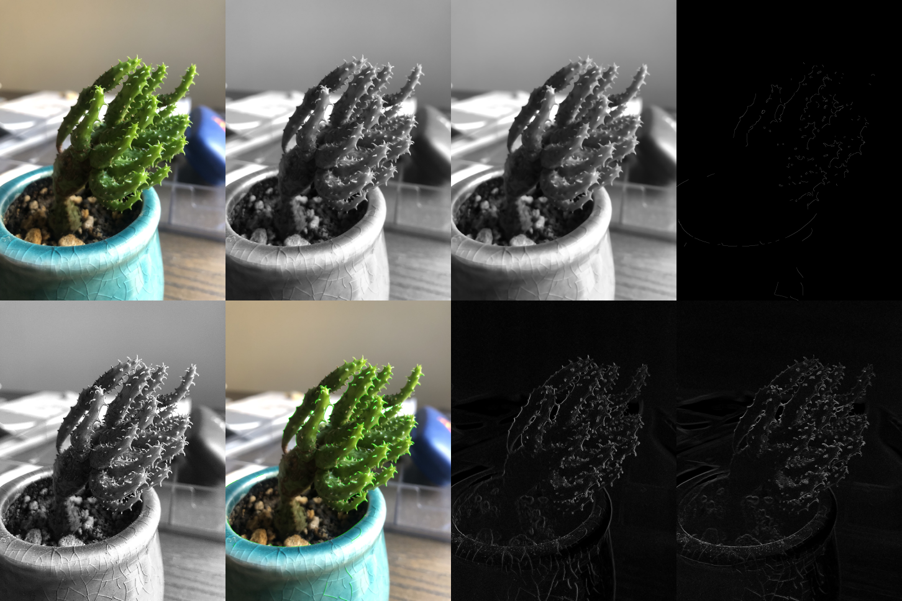

# OpenCV Image Processing Portfolio

## Overview

This project is a basic image processing pipeline implemented in C++ using OpenCV.

The application reads an input image and applies several processing steps, including grayscale conversion, median blur, Canny edge detection, unsharp masking (USM), Sobel filtering, histogram equalization, and contour extraction.

The processed results are displayed individually and combined into a single comparison image.

## Technologies

- C++
- OpenCV
- CMake
- Visual Studio / Visual Studio Code

## Features

- Convert an input image to grayscale
- Apply median blur
- Apply Canny edge detection
- Apply unsharp masking (USM)
- Apply Sobel filters in the X and Y directions
- Extract contours using `findContours`
- Apply histogram equalization
- Generate a comparison image
- Measure the execution time of each processing step

## Result

### Comparison Image

The following image is generated automatically as `comparison.png` when the application runs.



[Open the comparison image at full size](comparison.png)

## Discussion of Image Processing Filters

The input image contains a sharply focused plant against a blurred background. Strong light enters from the right side, creating a large difference between bright and dark areas.

### Grayscale Conversion

Grayscale conversion removes color information and represents the image using brightness values only. This simplifies subsequent edge-detection operations.

However, boundaries may become difficult to distinguish when the plant and background have similar brightness levels. Grayscale processing is suitable for analyzing shapes and brightness changes, but it is not suitable when color information is required to separate the green plant from the background.

### Median Filter

The median filter removes noise and small image details by replacing each pixel with the median value of its neighboring pixels.

This process reduces unnecessary edges caused by the soil, pot patterns, and small variations in the image. Unlike simple averaging, the median filter can reduce noise while preserving major edges relatively well.

However, an excessively large kernel may also remove the plant's thin projections and surface details. The current kernel size of `21` is relatively large. Kernel sizes between `5` and `9` should be tested when preserving fine details is important.

### Canny Edge Detection

Canny edge detection identifies areas where brightness changes rapidly. It detects the outline of the plant, its projections, the edge of the pot, and some details in the soil.

Because the background is blurred, fewer edges are detected in that area. However, strong reflections on the plant and the outlines of the pot and soil may also be detected.

The current threshold values of `80` and `200` prioritize strong edges. Lower thresholds may be more suitable when detecting thin projections and weaker plant boundaries.

### Unsharp Masking (USM)

Unsharp masking emphasizes edges and fine details by using the difference between the original image and a blurred version of the image.

This process makes the plant's surface texture, projections, and boundaries more visible. However, it can also amplify image noise and create unnatural edge artifacts around high-contrast areas.

The current multiplier of `3.0` produces strong sharpening. Values between `0.5` and `1.5` should be considered when a more natural result is required.

### Sobel Filter

The Sobel filter detects brightness changes in a specified direction.

- The X-direction filter mainly emphasizes vertical edges.
- The Y-direction filter mainly emphasizes horizontal edges.

The X-direction result highlights the vertically growing parts of the plant and the left and right sides of the pot. The Y-direction result highlights the upper edge of the pot and horizontally oriented plant projections.

Combining the X- and Y-direction results would make it possible to analyze edges in all directions.

### Contour Detection and Drawing

Contours are extracted from the Canny image and drawn in green on the original image.

This process detects not only the plant but also the pot and other objects with strong boundaries. If a Canny edge is incomplete, one object may also be divided into multiple small contours.

The program uses `cv::RETR_EXTERNAL`, so only the outermost contours are extracted. `cv::RETR_TREE` can be used when internal contours are also required.

Small unwanted contours can be removed by checking their areas with `cv::contourArea`.

### Histogram Equalization

Histogram equalization expands the grayscale intensity distribution and improves image contrast.

It can make shadowed areas of the plant and the inside of the pot easier to observe. However, it may also emphasize image noise and uneven lighting.

Because the input image has a large difference between bright and dark regions, Contrast Limited Adaptive Histogram Equalization (CLAHE) may provide better results by improving contrast locally.

### Overall Discussion

The plant is sharply focused while the background is blurred, making the image relatively suitable for edge detection.

However, the following characteristics affect the processing results:

- Strong lighting from the right side
- Bright reflections on the plant
- Dark shadowed regions inside the plant
- Strong edges from the pot and soil
- Small and thin projections on the plant

The current parameters are suitable for suppressing small details and detecting strong contours. To preserve the plant's thin projections, the following adjustments may be effective:

- Reduce the median-filter kernel size from `21` to approximately `5–9`
- Use lower Canny thresholds than the current `80` and `200`
- Reduce the USM multiplier from `3.0` to approximately `0.5–1.5`
- Use CLAHE instead of standard histogram equalization
- Remove small contours based on their areas

The parameters should be adjusted according to the intended purpose to achieve an appropriate balance between noise reduction and detail preservation.

## Processing Time

The average processing time was measured over 100 runs.

| Process | Average Time (ms) |
|---|---:|
| Grayscale conversion | 0.039384 |
| Median blur | 2.18832 |
| Canny edge detection | 0.060691 |
| Unsharp masking | 2.66679 |
| Contour extraction | 0.046373 |
| Contour drawing | 0.030404 |

The results show that median blur and unsharp masking require more processing time than the other operations. This is because USM performs both a blur operation and additional image-difference calculations.

The measured values may vary depending on the image size, hardware, compiler settings, OpenCV version, and build configuration.

## Highlights

- Implemented unsharp masking manually using blur and image difference
- Measured the average processing time over multiple runs
- Compared multiple image-processing results in one combined output image
- Separated the code into header and source files for readability
- Examined the effect of each filter on a real input image
- Identified parameter adjustments for improving detail preservation

## How to Build and Run

1. Clone or download the project.
2. Place the input image in the project directory.
3. Configure the project with CMake.
4. Build the project.
5. Run the generated executable.
6. Check the individual processing results and comparison image.

Example:

```bash
cmake -S . -B build
cmake --build build
./build/bin/app
